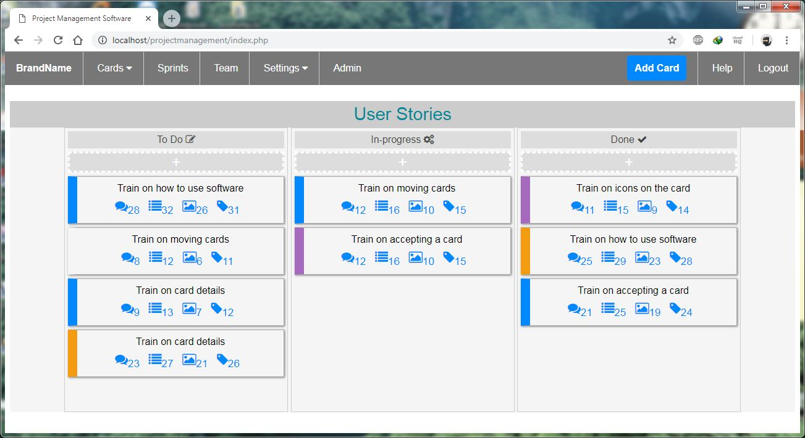

# `ProjectTrackingManagement`

- __Project Tracking Management is an inprogress application still being developed. To help project managers assign task to team members.__

## `Built With`

- PHP
- MYSQL
- HTML5
- CSS3
- JAVASCRIPT

## `Screenshot`

<!--
## `Live Demo`
 Click [here](https://mystifying-tereshkova-9e3c32.netlify.app) for Live Demo
 -->
 
 👤 **Author**

- Github: [@luckymolefe](https://github.com/luckymolefe)
- Twitter: [@Lucky_LuMo](https://twitter.com/Lucky_LuMo)
- Linkedin: [Lucky Molefe](https://www.linkedin.com/in/luck-molefe-02767092/)
- Email: luckmolf@gmail.com

## `Getting Started`

You may use the following steps to get a local copy:

-Clone project to your local machine 

-cd to the project directory 

-Open project in IDE Open Live Preview through IDE or

-use localhost to view the project in your browser

**`Contributing`**

You are welcome to make contributions to the repository. Contributions may be made through issues comments and feature requests.

You may find the issues page [here](https://github.com/luckymolefe/ProjectTrackingManagement/issues)
